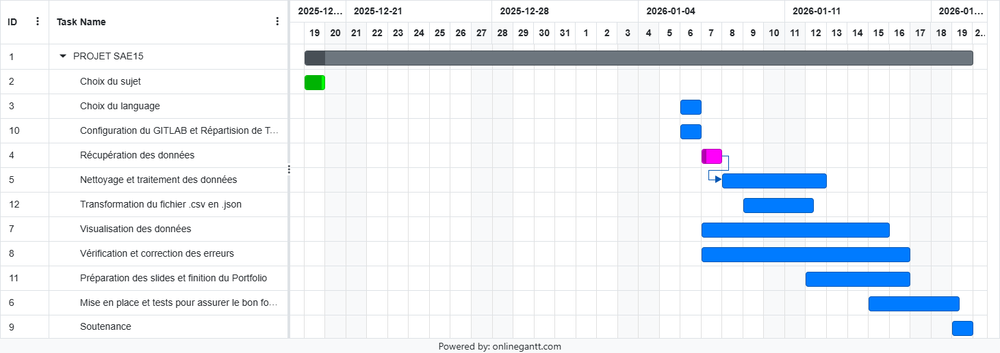

[English version](README.en.md)
---
# Sae15 Reussite Universitaire
[](https://www.python.org/)
[](#)
[](https://www.data.gouv.fr/api/1/datasets/r/18e77311-5d8f-424d-b73e-defc8f446ef6)

## Participants 
- DIAZENZA MOUANDA Regis Japhet
- BELGOUR Aicha Soulef
- ROLIN Tom
---
## Présentation du projet

Ce projet a pour objectif de récupérer des données ouvertes depuis **data.gouv.fr**, de les traiter à l’aide de scripts Python, puis de les transformer au format **JSON** afin de les exploiter dans une **visualisation graphique sur un site web**.
Les données étudiées concernent le **parcours et la réussite des bacheliers en DUT**.

## Objectifs du projet

- Extraction : Récupération des fichiers CSV depuis la plateforme data.gouv.fr.

- Transformation : Étude de la structure des données, nettoyage des valeurs (conversion des champs textuels en données numériques)

- Chargement : Production d’un fichier de résultats au format JSON (donnees_filtrees.json) ainsi que d’un graphique généré via QuickChart.
---
## Étapes pour exécuter le script

1. Prérequis :
Assurez-vous d'avoir Python3 installé avec les packages : `pandas`, `requests` (os, csv, json, sys, webbrowser sont déja inclue avec python3)
```bash
   pip install pandas requests
```
2. sauvgardez le script [code_final.py](./code_final.py) et executez le :
```bash
   python3 code_final.py
```
3. Le script effectue automatiquement :
- Télécharge le CSV depuis data.gouv.fr
- Nettoie les données (supprime certaines colonnes, remplace les valeurs manquantes par 0, supprime les doublons)
---
## Diagramme de Gantt

Ce diagramme de Gantt présente la planification complète de notre projet.


##  Technologies utilisées
- **Python 3**
- **requests** : téléchargement des données
- **pandas** : nettoyage et traitement des données
- **csv / json / os** : transformation des données
- **webbrowser** : ouverture automatique du résultat dans le navigateur

## 1. Extraction des fichiers : réalisé par DIAZENZA MOUANDA Regis Japhet
### Objectif
Télécharger le fichier CSV depuis **data.gouv.fr** et le nettoyer afin de le rendre exploitable.

### Bibliothèques utilisées
- **requests** : Récupération des données 
- **pandas** : Nettoyage des données récupérées


### Fonctionnement du script
- Téléchargement du CSV via l’API data.gouv.fr
- Suppression des colonnes inutiles (Id, sigle)
- Remplacement des valeurs manquantes par `0`
- Suppression des doublons
- Sauvegarde du fichier CSV nettoyé
---
## 2. Transformation des fichiers .csv en format .json : réalisé par ROLIN Tom
### Objectif
Convertir le fichier CSV nettoyé en **JSON**, format plus adapté aux échanges.

### Bibliothèques utilisées
- **csv** : lecture du fichier CSV
- **json** : écriture du fichier JSON
- **os** : vérification de l’existence des fichiers

### Fonctionnement du script
- Vérifie que le fichier CSV existe
- Lit le fichier CSV avec un séparateur (`;`)
- Convertit chaque ligne en dictionnaire Python
- Regroupe toutes les lignes dans une liste
- Écrit le résultat dans un fichier JSON formaté
---
## 3. Visualisation (Filtrage & Affichage) : réalisé par BELGOUR Aicha Soulef
### Objectif
Ce code permet de filtrer et de classifier les données, puis de générer des graphiques représentatifs grâce à **QuickChart**.

### Bibliothèques utilisées
- **pandas** : filtrage intelligent des données et calculs (`group by`)
- **requests** : envoi des données à l'API QuickChart pour générer l'image
- **webbrowser** : ouverture automatique du résultat dans le navigateur
- **os** : gestion des fichiers d'entrée/sortie

### Fonctionnement du script
- **Filtrage** : Lit le JSON et ne garde que les colonnes concernant la "Réussite" (Obtention) et la "Progression" (Passage)
- **Préparation** : Trie les DUT par taux de réussite (Top 20)
- **Génération** : Crée une URL de graphique via QuickChart (Barres pour Obtention, Lignes pour Passage)
- **Affichage** : Ouvre l'URL générée directement dans le navigateur web
---

- Sauvegarde le CSV nettoyé
- Convertit en JSON (donnees.json)
- Filtre les colonnes pertinentes dans donnees_filtrees.json
- Génère des graphiques 
- Ouvre les graphiques dans le navigateur
