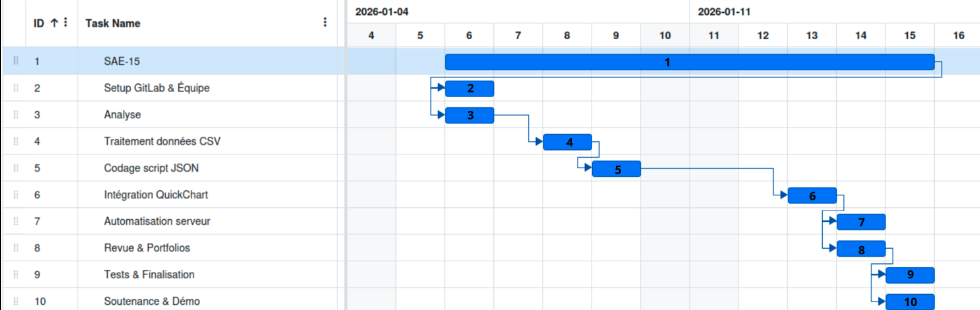

# SAE 15 - Traitement de données : Établissements Cinématographiques

Projet réalisé dans le cadre de la formation **BUT Réseaux & Télécommunications**.

**Auteurs :**
*   **Yanni Delattre-Balcer**
*   **Briac Le Meillat**

---

## 📝 Présentation du projet

Ce projet a pour objectif d'automatiser la récupération, le traitement et la visualisation de données ouvertes (Open Data). Nous avons choisi d'analyser les **établissements cinématographiques en France** à partir des données de `data.culture.gouv.fr`.

Le système permet de :
1.  **Télécharger** automatiquement les données CSV à jour.
2.  **Traiter** et nettoyer les données (agrégation par région, calcul du nombre d'écrans et de fauteuils).
3.  **Visualiser** les résultats sous forme de graphiques via une interface Web locale ou via l'API QuickChart.

## 🚀 Guide d'utilisation

### Prérequis

Assurez-vous d'avoir Python 3 installé. Les bibliothèques tierces nécessaires sont :
*   `requests`
*   `matplotlib`

Installation des dépendances :
```bash
pip install -r requirements.txt
# Ou manuellement :
pip install requests matplotlib
```

### Exécution

Pour lancer le programme principal (qui exécutera séquentiellement tous les scripts) :

```bash
python main.py
```

Un menu interactif vous proposera deux modes :
1.  **Graphique simple (QuickChart)** : Génère des URL de graphiques via l'API QuickChart.io et les ouvre dans votre navigateur.
2.  **Interface web complète** : Lance un serveur web local affichant un tableau de bord complet avec statistiques et graphiques.

---

## 📂 Architecture technique

### 0. Point d'entrée (`main.py`)
*   **Rôle** : Chef d'orchestre global.
*   **Fonction** : Exécute séquentiellement l'extraction, la transformation et la visualisation pour garantir un flux de données à jour.

### 1. Extraction (`scraper-data.py`)
*   **Source** : API Data Culture Gouv (fichier CSV).
*   **Objectif** : Récupère le fichier `etablissements-cinematographiques.csv`.
*   **Technique** : Utilisation de la librairie `requests`. Gestion des erreurs HTTP (codes 200/404).

### 2. Transformation (`formater-data.py`)
*   **Entrée** : Le fichier CSV brut.
*   **Traitement** : 
    *   Lecture et parsing CSV.
    *   Agrégation des données par région administrative.
    *   Calcul des sommes (écrans, fauteuils, nombre de cinémas).
    *   Génération de graphiques statiques avec `matplotlib` (pour le mode Web local).
*   **Sortie** : Fichier `formatted-etablissements-cinematographiques.json`.

### 3. Visualisation (`visualizer-data.py`)
*   **Rôle** : Interface utilisateur.
*   **Fonctionnalités** :
    *   **Mode QuickChart** : Envoie les données agrégées à `quickchart.io` pour générer le rendu.
    *   **Mode Web** : Serveur HTTP (`http.server`) servant une page HTML5/CSS3 moderne avec tableau de bord.

---

## 📊 Aperçu Visuel


---

## 👥 Répartition des tâches

Pour la répartition des tâches, nous avons réalisé un diagramme de Gantt que voici :



### Technologies utilisées

- Python 3
- requests
- csv
- json
- matplotlib as plt
- base64
- BytesIO from io
- os
- sys
- webbrowser

Pour le bonus (interface web) :
- http.server
- socketserver
- threading

### Réalisations de Yanni Delattre-Balcer
*   **Scraping** : Conception du script `scraper-data.py` (utilisation de `requests`).
*   **Planification** : Élaboration du **Diagramme de Gantt** pour la gestion de projet.
*   **Formatage (Partie 1)** : Structure initiale de `formater-data.py` (lecture CSV).
*   **Présentation** : Co-réalisation du diaporama.

### Réalisations de Briac Le Meillat
*   **Gestion GitLab** : Initialisation, configuration et co-versionnage du projet.
*   **Visualisation / Web** : Développement de l'affichage Web et intégration de l'API **QuickChart** (`visualizer-data.py`).
*   **Formatage (Partie 2)** : Finalisation de `formater-data.py`, gestion des erreurs et cohérence des données.
*   **Présentation** : Co-réalisation du diaporama.

**Travail commun** : Analyse initiale, tests complets et finalisation du Livrable.

